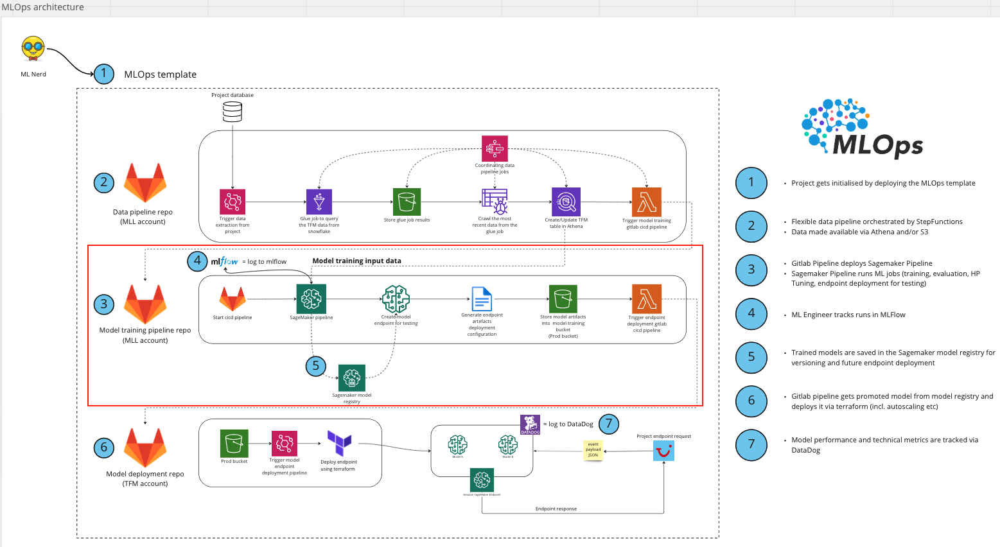

# MLLab model training pipeline template

MLL team model training pipeline template.

Project detailed info can be found at [Project homepage](https://confluence.tuigroup.com/x/sh6tQw)


### Project directory structure
------------

The directory structure of your new project looks like this: 

```
├── cfg                <- Contains the model training pipeline configurations for training and endpoint deployment.
│
├── docker             <- Contains training and processing images for the Sagemaker pipelines containers
│
├── images             <- Contains the repo documentation images
│
├── infra              <- Terraform files to generate the AWS resources required for the model training
│
├── notebooks          <- Jupyter notebooks are used as a sandbox environment.
│
├── scripts            <- Contains the python scripts that enable to launch the model training, generate the testing endpoint and also to 
│                         generate the model deployment files.
│
├── src                <- Source code for use in this project.
│   │
│   ├── autosacaling	<- Endpoint scaling scripts.
│   │
│   ├── data           <- Holds the data for the endpoint tests.
│   │
│   ├── model_build    <- Holds the python scripts to generate the training pipeline.
│   │
│   ├── model_deploy   <- Holds the python scripts to generate the endpoint.
│   │
│   ├── utils          <- Holds python scripts that are used across the different pipeline steps. 
│                         Also holds the market_simulator reinforcement learning training environment.
│
├── test               <- Holds the required files to test the endpoint.
│
├── Makefile           <- Makefile with commands like `make data` or `make train`
│
├── README.md          <- The top-level README for developers using this project.
│
├── requirements.txt   <- The requirements file for reproducing the analysis environment, e.g.
│                         generated with `pip freeze > requirements.txt`
```

## High level architecture


