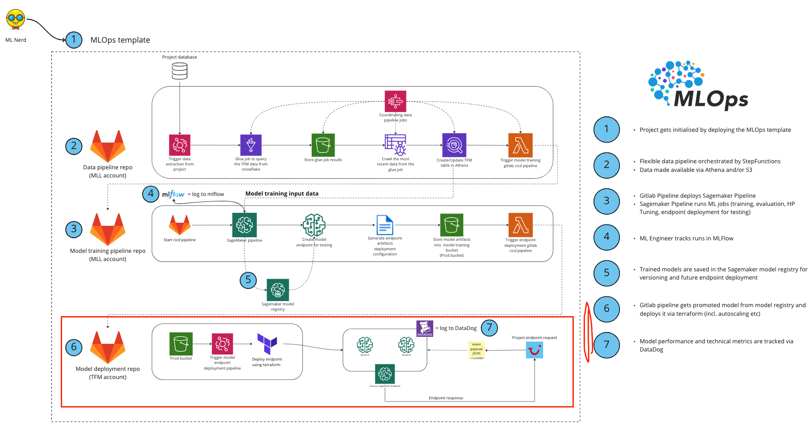

# MLLab endpoint deployment pipeline template

Data pipeline template to build robust data science ETL pipelines.
Project info can be found at [Project homepage](https://confluence.tuigroup.com/x/tR6tQw)


### Project directory structure
------------

The directory structure of your new project looks like this: 

```
├── images             <- Holds all project images
│
├── infra              <- Terraform files to generate the AWS resources required for the model training
│
├── requirements.txt   <- The requirements file for reproducing the analysis environment, e.g.
│                         generated with `pip freeze > requirements.txt`
```

## High level architecture


